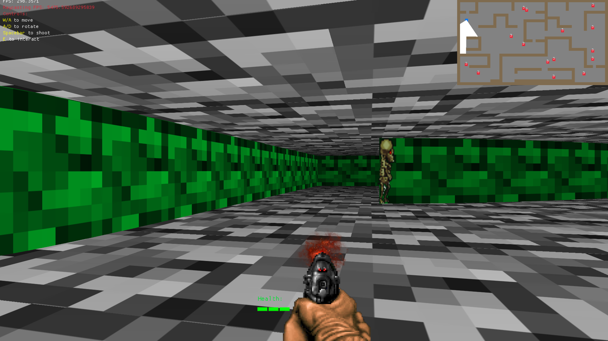

# DoomR

**DoomR** is a simple 2D raycasting game inspired by Wolfenstein 3D, developed in Rust as a learning project. It features a cleaner animation system, and was meant to teach more problem solving skills, as I tried to implement raycasting only with the most barebones knowledge of it.

## Getting Started

To run the game, use the following commands in the root directory of the project:

cargo run

Or for a release build:

cargo run --release

### Controls (SEE INGAME TOP LEFT)

- **WASD**: Move the character.
- **Spacebar**: Shoot.
- **E**: To interact.

## Known Limitations

- **Enemy AI**: AI behavior is basic and may not respond perfectly in complex environments.
- **Collision**: Collision works, but enemies sometimes get stuck in a diagonal Wall for a bit too long.
- **Level Design**: Levels are simple, there's no winning.
- **Fisheye Effect**: Kept the fish eye effect because it looks cool. (This makes walking through 1 wide places a bit unclear visually).

## License

This project is licensed under the MIT License.
